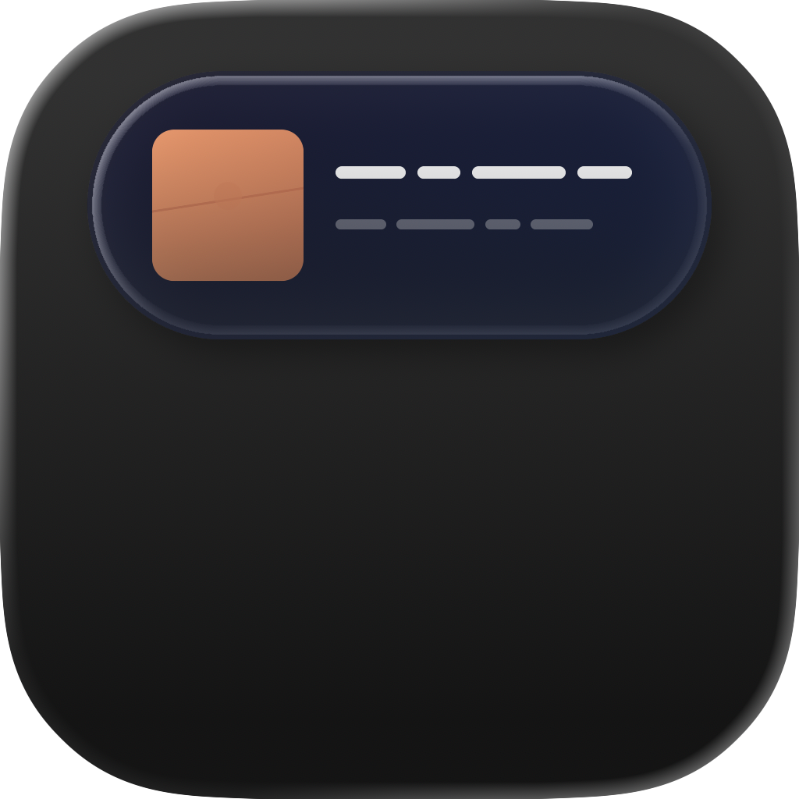

  

<h1 align="center">Lyrisland</h1>

  <em>/ˈlɪrɪslænd/</em> — Lyrics + Island

  macOS 灵动岛风格的 Spotify 实时歌词显示

  
  

---

## What is Lyrisland?

Lyrisland 在屏幕顶部以灵动岛（Dynamic Island）的形式，实时展示 Spotify 正在播放的歌词。歌词与音乐精准同步，轻巧优雅，常驻桌面。

## Features

- **灵动岛形态** — 紧凑、展开、全屏三种模式，点击切换，流畅动画过渡
- **实时同步** — 歌词逐行高亮，与播放进度精准对齐
- **多歌词源** — 自动从多个来源查找歌词，找不到时智能回退
- **无需登录** — 直接读取本地 Spotify 客户端状态，无需授权 Spotify 账号
- **轻量常驻** — 仅在菜单栏运行，不占用 Dock 栏，低资源占用
- **手动微调** — 支持歌词偏移量调整（±0.5s），适配不同歌词源的时间差

## Preview

<!-- 在此放置截图或 GIF -->

| Compact | Expanded | Full |
|:---:|:---:|:---:|
| 单行歌词 | 上下文预览 | 完整歌词列表 |

## Getting Started

1. 确保已安装 [Spotify 桌面客户端](https://www.spotify.com/download/)
2. 下载并打开 Lyrisland
3. 首次启动时，macOS 会请求自动化权限 — 请点击允许
4. 在 Spotify 播放一首歌，歌词将自动出现在屏幕顶部

## Requirements

- macOS 14.0 (Sonoma) 或更高版本
- Spotify 桌面客户端

## FAQ

**Q: 需要登录 Spotify 账号吗？**
不需要。Lyrisland 读取本地 Spotify 客户端的播放信息，不涉及账号授权。

**Q: 为什么有些歌没有歌词？**
歌词来自第三方公开数据库，冷门曲目或纯音乐可能暂无收录。

**Q: 歌词和音乐不同步怎么办？**
在菜单栏图标中使用偏移量调整（`[` / `]` 键，每次 ±0.5 秒）。

**Q: 支持 Apple Music 吗？**
目前仅支持 Spotify。

## License

All rights reserved.
